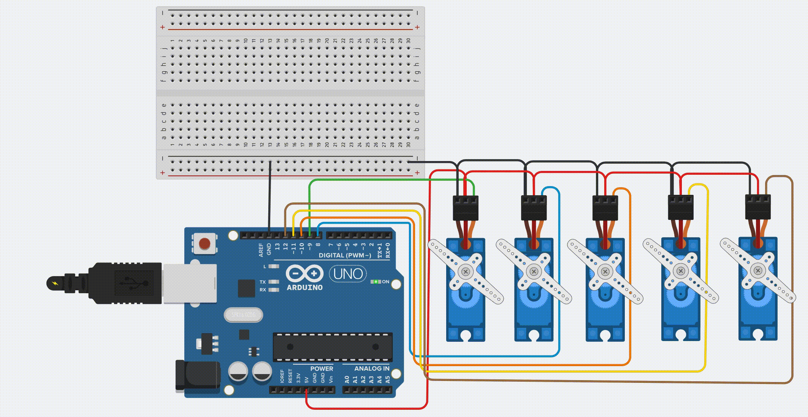

# Rrobot Arm Circuit With 5 Servo-Motors

* This repository contains an electronic circuit design to control 5 servo motors for the robot arm.
* Each servo motor rotates at an angle of 90°

The Robot Arm Circuit
===================

